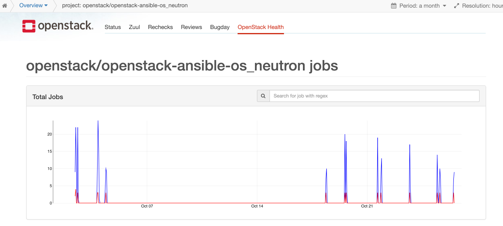
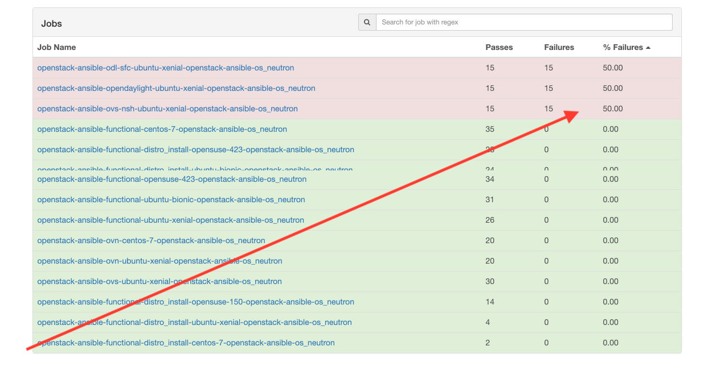
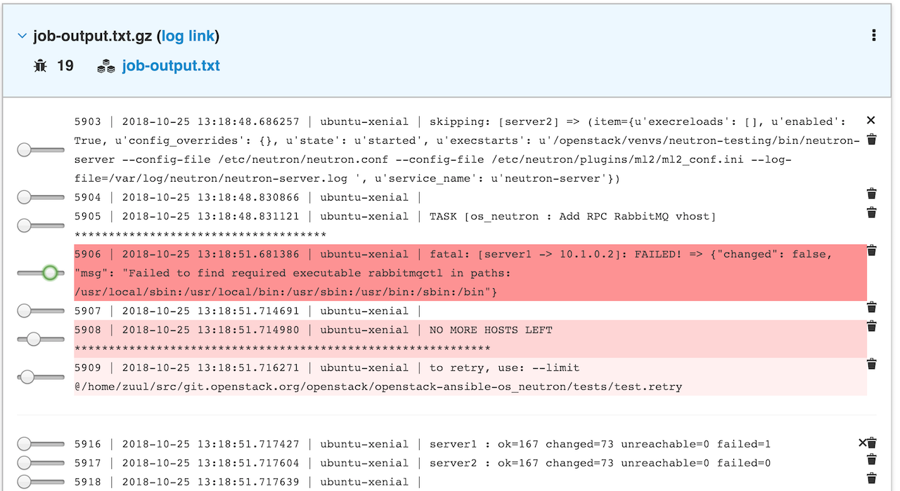
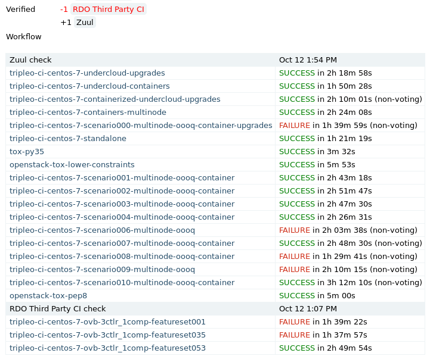
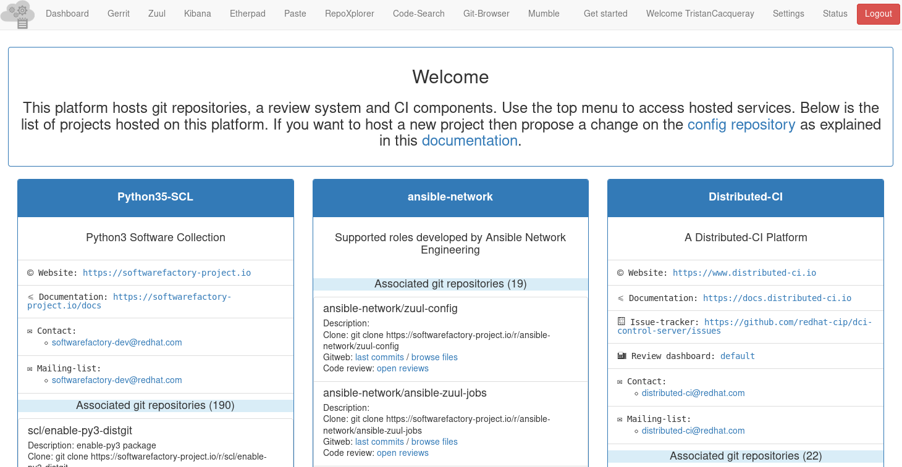

[comment]: # (Warm-up - Why are we presenting?)
### We are software engineers


Note:
- Tristan works for Red Hat and has been a member of the OpenStack
  Vulnerability Management Team for more than 3 years
  His work focuses on CI/CD solutions
- Dirk works for SUSE and spends too much time looking at log files :)


### We love ~~YouTube~~ OpenStack Health


Note:
- OpenStack runs one of the largest CI systems for OpenSource software
- It produces tremendous amount of results and data
- This graph from OpenStack Health shows that each project undergoes
  many runs daily


### We watch OpenStack Health


Note:
- Sometimes jobs fail unexpectedly


### Let's peek at the log...
<!-- .slide: data-background-image="images/job-log-output-zoom-out.png" -->

Note:
- Here we see that about 2% of the OpenStack Infra job log
  http://logs.openstack.org/86/613286/1/check/openstack-ansible-opendaylight-ubuntu-xenial/616f532/job-output.txt.gz
- There is an error in there, can you see it?


# ?
<!-- .slide: data-background-image="images/job-log-output-zoom-out.png" -->


### Did you find it?
<!-- .slide: data-background-image="images/job-log-output-zoom-out.png" -->


### Current Process


Note:
- This diagram shows the current actions a developper usually does to
  understand why a job failed
- This process is tedious and time consuming and usually involves lots
  of clicking and scrolling...


### What if the machine looked for the errors?


Note:
- Most of this process can be automated
- Automatic anomaly detection may greatly reduce investigation time


### Log-Classify


Note:
- In this presentation, we'll see how to go from a long boring log file
  to a condensed exciting report of anomalies to look for


## Today's plan<!-- .element: style="color: white; background-color:rgba(0, 0, 0, 0.6)" -->
<!-- .slide: data-background-image="images/berlin.jpg" -->

Short Intro to Machine Learning <!-- .element: style="color: white; background-color:rgba(0, 0, 0, 0.6)" -->

Tool Presentation <!-- .element: style="color: white; background-color:rgba(0, 0, 0, 0.6)" -->

CI Logs Classification <!-- .element: style="color: white; background-color:rgba(0, 0, 0, 0.6)" -->


### Taxonomy
- Artificial Intelligence
- Machine Learning
- k-Nearest Neighbors
- Build    <!-- .element: class="fragment" data-fragment-index="1" -->
- Baseline <!-- .element: class="fragment" data-fragment-index="1" -->
- Target   <!-- .element: class="fragment" data-fragment-index="1" -->

Note:
- AI is a growing branch of computer science with a broad scope.
- ML is a field of artificial intelligence that uses statistical techniques.
- And Nearest Neighbors is one of the simplest of all ML algorithms that
  we will explore today.
- In this presentation:
  - Build defines generic process that generates logs, e.g. CI jobs,
    deployment scripts, service operations, ...
  - Baseline defines nominal build
  - Target defines build that we want to analyze.
- Deep Learning (neural network modelling) is an instance of generalizing learning
- Nearest Neighboars is an instance based learning algorithm


## Using machine learning to remove noise


Note:
- This section introduces the base principle along with
  two objects that can be used with logs:
  - the HashingVectorizer processor; and
  - the NearestNeighbor model
- Note that other models may easily be used while keeping the same
  generic workflow


### Generic Training Workflow


Note:
- This diagram shows how baselines are processed to train a model
- The raw text lines need to be converted before being used by a
  machine learning model


### Generic Testing Workflow


Note:
- After the model is trained, we can repeat the same process to test
  the target and extract the novelties
- Next we will see how to implement such model
TODO: split the diagram in multiple slides


### Noise Reduction
<table><tr><th>Token</th><th>Raw text</th>
<tr><td><pre>DATE</pre></td><td>months/days/date</td></tr>
<tr><td><pre>RNGU</pre></td><td>UUIDs</td></tr>
<tr><td><pre>RNGI</pre></td><td>IPv4 or IPv6 addresses</td></tr>
<tr><td><pre>RNGN</pre></td><td>words that are exactly 32, 64 or 128 chars</td></tr>
<tr><td><pre>RNGD</pre></td><td>numbers of at least 3 digits</td></tr>
</table>

Note:
- We already know what is not relevant for log analysis
- Random words may be replaced with known tokens
- Generic tokenization greatly reduce the complexity


### Hashing Vectorizer


Note:
- The raw log lines needs to be transformed into
  something more convenient for machines.
- After tokenization, the Hashing Vectorizer convert each
  words into a numeric token.
- And it encodes the token occurence information into a
  sparse matrix array of all possible hashes
  (2**20 by default).
- Each vector is very sparse as it only contains the token hashes


### Example of Devstack Vectors


Note:
- This example shows the vectors of a devstack job-output of 34k lines
- The green dots show baseline vectors
- The red dots show target vectors
- This representation shows all the vectors in order, though we will
look for the distances of each target vector to any baseline vectors
- Next we will see how to interpret those vectors


### Nearest Neighbors


Note:
- Nearest Neighbors learns from baseline vectors
- It enables efficient regression analysis that can
  be used to quickly compute the distance of targets
  vectors to the baselines


### kNeighbors computes vector's distance


Note:
- This example illustrates a knn search from the previous devstack example.
- In this case the line contains unknown tokens showed in red
  which increase the distance a lot.
- The next section introduces an easy-to-use implementation of this technique.


## Introducing log-classify


### Log-classify
- Based on http://scikit-learn.org/
  - Python :-)
  - Many parameters to play with
- Generic Hashing Text classifier
  - Assumes text, line based log input

Note:
- scikit-learn provides many text classifiers
- Chose HashingVectorizer which is best for logfile types as others work better on natural language


### log-classify: First steps

-  Published on PyPI
```bash
    $ pip3 install --user logreduce
    $ logreduce dir-train model.clf baseline/*
    $ logreduce dir-run model.clf error.txt
```


### logreduce: Output

```bash
$ logreduce diff  logs/good.txt logs/bad.txt
0.527 | bad.txt:34245:  2018-10-09 05:56:51.021261 | controller |     Details: {u'created': u'2018-10-09T05:11:20Z', u'code': 500, u'message': u'Exceeded maximum number of retries. Exhausted all hosts available for retrying build failures for instance d7046aa3-e885-4ed6-80e7-d7a7eff9f883.'}
97.98% reduction (from 35244 lines to 712)
```

Multiple baselines can be used

```bash
    $ logreduce dir-train model.clf baseline/*
```


### Managing baseline


Note:
- The key to using k-NN regression for anomaly detection is to have a database of known good baselines


### Journald
- Extract novelty from the last day:
```bash
    $ logreduce journal --range day
```
- Build a model using last month's logs and look for novelties in the last week:

```bash-
    $ logreduce journal-train -- range month journal.clf
    $ logreduce journal-run   --range week  journald.clf
...
99.76% reduction (from 7804 lines to 19)
```

Note:
    - The journald range sets the baseline as the previous day/week/month and
      the target as the current day/week/month
**** DEMO: generate some syslog events (e.g. run logger, kill a service, ...),
show that looking at journalctl is boring,
then using a pre-trained model, extract the new events


### Sos Report
```bash
$ logreduce --debug diff report-good/ report-bad/ \
            --html report.html
INFO  Classifier - Training took 84.141 seconds to ingest 33.458 MB
INFO  Classifier - Testing took 173.464 seconds to test 22.952 MB
99.67% reduction (from 128882 lines to 424)
```

Note:
- A model is built per file. The model name is a minified version of the
  filename to include variations, e.g. audit.1 and audit.2 use
  the same model
- "Loading" and "Testing" debug shows the /model-name/: used for each file
- Before printing the anomalies, the baseline sources are also displayed,
  see the /compared with/ debug
**** DEMO: open a pre-generated html report and show non obvious issue that are
detected


### Clustering
- no clustering (DBSCAN, k-means) implemented yet
- would be useful for finding outliers


### Web Frontend
- React interface for anomaly classification


- Need further development <!-- .element: class="fragment" data-fragment-index="1" -->

Note:
- The server and web frontend only support Zuul Build at the moment
- Failure classification into category and model re-enforcement
  is still under discussion.
- Next we will see how such tool can be used in a CI context.


## CI Workflow

Note:
- Using the tool manually may be cumbersome
- We will now see different ways to integrate anomaly detection
  in a CI workflow
TODO: split the diagram in multiple slides


### Build results


Note:
- CI jobs are great targets for k-NN regression because the job outputs are
  often deterministic and previous runs can be automatically used as baselines
- At the end of run, the user is presented with a list of job result,
  and the goal is to help him understand why a job failed.


### Zuul Architecture


Note:
- This diagram shows the basic zuul workflow
- Jobs are executed on ephemeral test instances
- The executor retrieves the logs and publishes them to a logserver
- Zuul returns the logserver url to the user
- Zuul stores build information in a database. This is the key component
  to make the log-classify process automatic for CI logs.


### Post-Run Analysis


Note:
- This diagram shows the log-classify process running on the executor node
- Pros: users/jobs don't have to be adapted, the post-run can be added to the base job
- Cons: memory/cpu overhead on shared resources


### Post-Run Playbook
```yaml
    - job:
        name: base
        post-run:
          - clasify-log
          - upload-log
```
```yaml
    - tasks:
      - name: Fetch or build the model
        command: log-classify job-build ...
      - name: Generate report
        command: log-classify job-run ...
      - name: Return report url
        zuul_return: report.html
```

Note:
- This is an example integration in the base job.
- Log-classify comes with zuul-jobs roles ready to be
used.


### Standalone Service


Note:
- Log-classify can be deployed as a service to run analysis
  after the job execution.
- Trigger could be automatic after log upload, or requested
  manually.
- Pros: enable user interaction, for example,
  feedback false-positive, centralized index of anomalies, ...
- Cons: asynchronous, builds result still points at
  directory index of raw files.


### Demo
<video><source data-src="videos/short.webm" type="video/webm" /></video>

Note:
- Grab a failed job from zuul.openstack.org, put the uuid in the new form
  and show the report interface
- Or fallback to recorded demo


### Limitations
- Nearest Neighbor uses brute force search.     <!-- .element: class="fragment" data-fragment-index="1" -->
- Complexcity grows linearly with samples size. <!-- .element: class="fragment" data-fragment-index="2" -->
- Noise may hide important information.         <!-- .element: class="fragment" data-fragment-index="3" -->
- Logs may contain many features.               <!-- .element: class="fragment" data-fragment-index="4" -->

Note:
- Preliminary work based on the HashingVectorizer. It works well for
  a large majority of log files.
- The current Nearest Neighbor implementation actually uses a
  brute force search for sparse matric vectors:
  http://scikit-learn.org/stable/modules/neighbors.html#nearest-neighbor-algorithms
- Which means that search complexity grows linearly with samples size
- Because it is an unsupervised learning model, short failure message
  may be indeferent from noise.
- NN doesn't work well if logfile contains too many
  sparse features. Mistral logs, i'm looking at you :)


### Unique vectors per job


Note:
- This graph shows the number of unique vectors found in
  tempest-full job-output.


### Performances per sample size


Note:
- This graph shows search time growing linearly with sample sizes.
- Samples sizes above 1 millions vectors aren't practical, it
  would takes 40ms to compute one distance, so about 10 minutes to
  process a typical tempest-full job-output.


## Conclusions


### How to contribute

Log-Classify is hosted on softwarefactory-project.io


- Apache-2.0 Licensed
- #log-classify on Freenode

Note:
- Log-classify has been created in the context of Software Factory
- It is an OpenSource development forge that integrates many component to
  be easily deployed on premise or as a service
- The architecture is modular and the screenshot shows some of
  the ready-to-use components
- Logreduce is integrated as part of the default CI logs processing


### Future plans
- Adaptive model
- Incremental model training
- Handle Streaming logs
- Logstash filter
- Curate public domain datasets
- Fingerprint and detect archived anomalies
- Support more services: Jenkins build, Travis CI, ...

Note:
- This is a tentative roadmap
- Other model may be used depending on baseline sample sizes, e.g. ANN, Word2Vec
- A public domain dataset to enable further research in that field
  Having a common dataset to test new models would help find new solutions
- Detect known "fingerprint" similarly to the elastic-recheck
- Support more services to discover baselines

- And this concludes the presentation
- Q&A time
- Thank you for your time!


## Credits
Icons used in these diagrams are licensed under
Creative Commons Attribution 3.0:
- https://fontawesome.com/license
- https://zuul-ci.org
